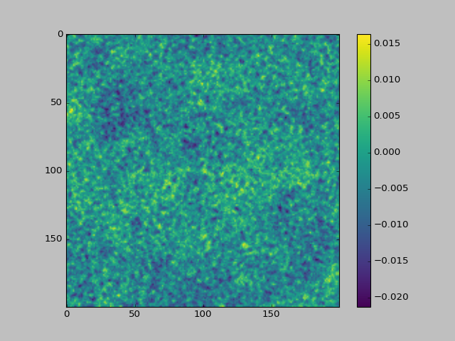
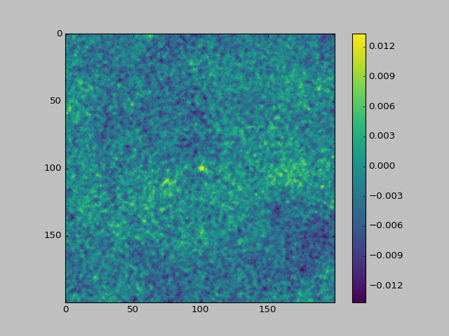

# Astronomical-Survey-Coursera-Data-Driven-Astronomy

**Non-detection of Pulsars** -  
In astronomy, there exists a problem of non-detection of pulsars. What this means is, that the SNR is so low that the images captured look like they’re just noise. To get rid of this, and to obtain a good image with a detected pulsar, stacking of images is used. There are two methods- mean stacking and median stacking. 
  
The following are the individual images used. As it can be seen, all the images look like they have not detected any pulsar.   
   
    
After applying mean stacking, the following images are obtained after applying mean and median stacking respectively-  
    
In both the images a bright spot can be seen at the centre. That is the detected pulsar. Median stacking is advantageous over mean becuase it removes more noise, and gives a much cleaner image.   

**Sky analysis**  
In astronomy, images can be obtained from different electromagnetic bands. Different features are visible in different bands, hence it’s necessary to look at them all. Sometimes to make sure a particular entity is detected in the sky, it’s checked using other band images too. For eg. entity X is visible in band A and band B. Say, I obtain some signal in band A, which I’m ot sure denotes X or not. To make sure, I would check for signals in the same region of band B image. If it is there, then X was correctly detected, else no. This checking is done through cross-matching algorithm and is used to make sky catalogues.
